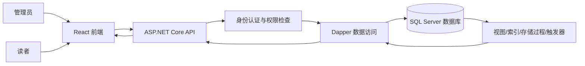
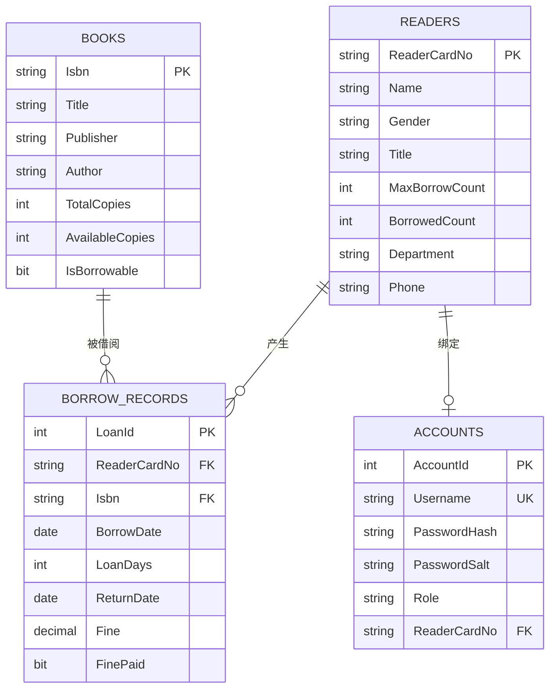

# 数据库设计报告

实验名：图书馆系统设计

## 0. 文档介绍

本报告面向中山大学深圳校区简易图书管理系统的数据库部分，说明数据库环境、命名规则、需求分析、概念结构、逻辑结构、完整性约束、安全性设计和维护方案。系统面向管理员和读者两类用户，实现图书管理、读者管理、账号管理、借阅管理、逾期查询、罚款处理和统计分析等功能。

### 0.1 文档目的

本文档用于指导数据库建模、后端 API 开发和课程项目验收，重点说明如何使用关系数据库模型支撑图书借阅业务，并通过主键、外键、检查约束、唯一约束、视图、索引、存储过程、触发器和事务保证数据一致性与完整性。

### 0.2 文档范围

报告覆盖以下内容：

- 数据库运行环境和命名规则。
- 图书、读者、账号、借阅记录四张核心表的数据字典。
- E-R 图、关系模式、函数依赖和范式分析。
- 完整性约束、事务控制、并发控制、索引和数据库对象设计。
- 安全性、备份恢复和日常维护说明。

### 0.3 术语与缩写解释

| 术语 | 说明 |
| --- | --- |
| UI 层 | React 前端应用，负责界面展示和用户交互。 |
| BLL 层 | ASP.NET Core API 中承载业务规则的服务逻辑。 |
| DAL 层 | 使用 Dapper 访问 SQL Server 的数据访问逻辑。 |
| 借阅记录 | 读者借阅图书后产生的业务记录，包含借出日期、归还日期、借阅期限和罚款状态。 |
| Admin | 管理员角色，可管理系统中的图书、读者、账号和借阅数据。 |
| Reader | 普通读者角色，可查询图书和个人借阅信息，并进行自助借书。 |

## 1. 数据库环境说明

| 项目 | 内容 |
| --- | --- |
| 数据库系统 | Microsoft SQL Server 2022 |
| 部署方式 | Docker Compose 启动 SQL Server 容器 |
| 数据库名 | `LibrarySystemDb` |
| 后端环境 | ASP.NET Core 8 + Dapper |
| 前端环境 | React + Vite + TypeScript |
| 桌面端 | WinForms + WebView2 |
| 建库脚本 | `database/01_schema.sql` |
| 初始化数据脚本 | `database/02_seed.sql` |

## 2. 数据库命名规则

- 数据库命名为 `LibrarySystemDb`，与系统名称保持一致。
- 表名采用 PascalCase 复数名词，如 `Books`、`Readers`、`Accounts`、`BorrowRecords`。
- 字段名采用 PascalCase，如 `ReaderCardNo`、`AvailableCopies`、`BorrowDate`。
- 业务主键直接使用业务字段名，如 `Books.Isbn`、`Readers.ReaderCardNo`。
- 无业务含义的代理主键使用 `Id` 结尾，如 `AccountId`、`LoanId`。
- 外键字段沿用被引用表的主键字段名，如 `ReaderCardNo`、`Isbn`。
- 约束命名包含约束类型和表名，如 `PK_Books`、`FK_BorrowRecords_Readers`、`CK_Books_AvailableCopies`。

## 3. 需求分析

### 3.1 数据流图



### 3.2 功能模块划分

- 管理员端：图书管理、读者管理、账号管理、借阅记录维护、借书、还书、缴罚款、逾期查询、统计看板。
- 读者端：图书检索、自助借书、个人信息查看、个人借阅记录查看、个人逾期记录查看。
- 数据库端：存储核心业务数据，维护数据完整性，提供逾期视图、借还书存储过程、罚款缴纳存储过程和逾期限制触发器。

### 3.3 数据字典

#### 3.3.1 图书表 `Books`

| 字段名 | 类型 | 长度 | 允许空 | 主/外键 | 默认值 | 说明 | 业务约束 |
| --- | --- | --- | --- | --- | --- | --- | --- |
| `Isbn` | `NVARCHAR` | 20 | 否 | 主键 | 无 | 国际标准书号，唯一标识一本图书 | 唯一、非空 |
| `Title` | `NVARCHAR` | 100 | 否 | - | 无 | 书名 | 非空 |
| `Publisher` | `NVARCHAR` | 100 | 否 | - | 无 | 出版社 | 非空 |
| `Author` | `NVARCHAR` | 100 | 否 | - | 无 | 作者 | 非空 |
| `TotalCopies` | `INT` | - | 否 | - | 1 | 馆藏总数 | `TotalCopies >= 0` |
| `AvailableCopies` | `INT` | - | 否 | - | 1 | 可借数量 | `0 <= AvailableCopies <= TotalCopies` |
| `IsBorrowable` | `BIT` | - | 否 | - | 1 | 是否可借 | 1 表示可借 |
| `CreatedAt` | `DATETIME2` | - | 否 | - | `SYSUTCDATETIME()` | 创建时间 | 自动生成 |
| `UpdatedAt` | `DATETIME2` | - | 否 | - | `SYSUTCDATETIME()` | 更新时间 | 修改时更新 |

#### 3.3.2 读者表 `Readers`

| 字段名 | 类型 | 长度 | 允许空 | 主/外键 | 默认值 | 说明 | 业务约束 |
| --- | --- | --- | --- | --- | --- | --- | --- |
| `ReaderCardNo` | `NVARCHAR` | 30 | 否 | 主键 | 无 | 借书证号 | 唯一、非空 |
| `Name` | `NVARCHAR` | 50 | 否 | - | 无 | 读者姓名 | 非空 |
| `Gender` | `NVARCHAR` | 10 | 否 | - | 男 | 性别 | 只能为男、女、其他 |
| `Title` | `NVARCHAR` | 50 | 否 | - | 学生 | 身份或职称 | 非空 |
| `MaxBorrowCount` | `INT` | - | 否 | - | 5 | 最大可借数量 | 0 到 20 |
| `BorrowedCount` | `INT` | - | 否 | - | 0 | 当前已借数量 | `0 <= BorrowedCount <= MaxBorrowCount` |
| `Department` | `NVARCHAR` | 100 | 否 | - | 无 | 学院或部门 | 非空 |
| `Phone` | `NVARCHAR` | 30 | 是 | - | `NULL` | 联系电话 | 可空 |
| `CreatedAt` | `DATETIME2` | - | 否 | - | `SYSUTCDATETIME()` | 创建时间 | 自动生成 |
| `UpdatedAt` | `DATETIME2` | - | 否 | - | `SYSUTCDATETIME()` | 更新时间 | 修改时更新 |

#### 3.3.3 账号表 `Accounts`

| 字段名 | 类型 | 长度 | 允许空 | 主/外键 | 默认值 | 说明 | 业务约束 |
| --- | --- | --- | --- | --- | --- | --- | --- |
| `AccountId` | `INT` | - | 否 | 主键 | 自增 | 账号流水号 | 唯一 |
| `Username` | `NVARCHAR` | 50 | 否 | 唯一 | 无 | 登录账号 | 唯一、非空 |
| `PasswordHash` | `CHAR` | 64 | 否 | - | 无 | SHA-256 密码哈希值 | 非空 |
| `PasswordSalt` | `NVARCHAR` | 64 | 否 | - | `LIBRARY_SYSTEM_2026` | 密码盐值 | 非空 |
| `Role` | `NVARCHAR` | 20 | 否 | - | 无 | 用户角色 | 只能为 Admin 或 Reader |
| `ReaderCardNo` | `NVARCHAR` | 30 | 是 | 外键 | `NULL` | 绑定的读者证号 | Reader 必须绑定读者 |
| `IsEnabled` | `BIT` | - | 否 | - | 1 | 账号是否启用 | 0 表示禁用 |
| `CreatedAt` | `DATETIME2` | - | 否 | - | `SYSUTCDATETIME()` | 创建时间 | 自动生成 |

说明：`UQ_Accounts_ReaderCardNo` 过滤唯一索引保证一个读者最多绑定一个账号，且允许管理员账号不绑定读者。

#### 3.3.4 借阅记录表 `BorrowRecords`

| 字段名 | 类型 | 长度 | 允许空 | 主/外键 | 默认值 | 说明 | 业务约束 |
| --- | --- | --- | --- | --- | --- | --- | --- |
| `LoanId` | `INT` | - | 否 | 主键 | 自增 | 借阅流水号 | 唯一 |
| `ReaderCardNo` | `NVARCHAR` | 30 | 否 | 外键 | 无 | 借书证号 | 必须引用有效读者 |
| `Isbn` | `NVARCHAR` | 20 | 否 | 外键 | 无 | 图书 ISBN | 必须引用有效图书 |
| `BorrowDate` | `DATE` | - | 否 | - | 当天日期 | 借出日期 | 非空 |
| `LoanDays` | `INT` | - | 否 | - | 30 | 借阅天数 | 1 到 180 天 |
| `ReturnDate` | `DATE` | - | 是 | - | `NULL` | 实际归还日期 | `NULL` 表示未归还 |
| `Fine` | `DECIMAL` | 10,2 | 否 | - | 0 | 罚款金额 | `Fine >= 0` |
| `FinePaid` | `BIT` | - | 否 | - | 1 | 罚款是否已缴纳 | 1 表示已缴或无需缴纳 |
| `Remark` | `NVARCHAR` | 200 | 是 | - | `NULL` | 备注 | 可空 |
| `CreatedAt` | `DATETIME2` | - | 否 | - | `SYSUTCDATETIME()` | 创建时间 | 自动生成 |

### 3.4 业务规则汇总

| 编号 | 规则说明 | 数据库实现 |
| --- | --- | --- |
| BR-001 | 图书馆藏总数不能为负数 | `CK_Books_TotalCopies` |
| BR-002 | 图书可借数量不能为负数，且不能超过馆藏总数 | `CK_Books_AvailableCopies` |
| BR-003 | 读者最大可借数量范围为 0 到 20 | `CK_Readers_MaxBorrowCount` |
| BR-004 | 当前已借数量不能超过最大可借数量 | `CK_Readers_BorrowedCount` |
| BR-005 | 借阅期限为 1 到 180 天 | `CK_BorrowRecords_LoanDays` |
| BR-006 | 还书日期不能早于借书日期 | `CK_BorrowRecords_ReturnDate` |
| BR-007 | 借书时必须有库存，且读者未超过可借上限 | `sp_BorrowBook` |
| BR-008 | 借书成功后，图书可借数量减 1，读者已借数量加 1 | `sp_BorrowBook` 事务 |
| BR-009 | 还书成功后，图书可借数量加 1，读者已借数量减 1 | `sp_ReturnBook` 事务 |
| BR-010 | 逾期罚款按每天 0.50 元计算 | `sp_ReturnBook`、`vw_OverdueBorrowRecords` |
| BR-011 | 已归还但未缴罚款的读者不能继续借书 | `sp_BorrowBook` |
| BR-012 | 当前存在逾期未还记录的读者不能继续借书 | `trg_CheckOverdueOnBorrow` |
| BR-013 | Reader 账号必须绑定读者，Admin 账号可以不绑定读者 | `CK_Accounts_ReaderRole` |
| BR-014 | 一个读者最多绑定一个账号 | `UQ_Accounts_ReaderCardNo` |

## 4. 概念设计

### 4.1 E-R 图



### 4.2 实体关系说明

- 图书与借阅记录是一对多关系：一本图书可以产生多条借阅记录，一条借阅记录只对应一本图书。
- 读者与借阅记录是一对多关系：一个读者可以产生多条借阅记录，一条借阅记录只属于一个读者。
- 读者与账号是一对零或一关系：一个读者最多绑定一个登录账号，管理员账号不需要绑定读者。
- `BorrowRecords` 是读者和图书之间多对多借阅关系的联系实体，用于保存每一次借阅的时间、状态和罚款信息。

## 5. 逻辑设计

### 5.1 关系模式

- 图书信息表：`Books(Isbn, Title, Publisher, Author, TotalCopies, AvailableCopies, IsBorrowable, CreatedAt, UpdatedAt)`
- 读者信息表：`Readers(ReaderCardNo, Name, Gender, Title, MaxBorrowCount, BorrowedCount, Department, Phone, CreatedAt, UpdatedAt)`
- 账号表：`Accounts(AccountId, Username, PasswordHash, PasswordSalt, Role, ReaderCardNo, IsEnabled, CreatedAt)`
- 借阅记录表：`BorrowRecords(LoanId, ReaderCardNo, Isbn, BorrowDate, LoanDays, ReturnDate, Fine, FinePaid, Remark, CreatedAt)`

### 5.2 函数依赖分析

- `Books`：`Isbn -> Title, Publisher, Author, TotalCopies, AvailableCopies, IsBorrowable, CreatedAt, UpdatedAt`
- `Readers`：`ReaderCardNo -> Name, Gender, Title, MaxBorrowCount, BorrowedCount, Department, Phone, CreatedAt, UpdatedAt`
- `Accounts`：`AccountId -> Username, PasswordHash, PasswordSalt, Role, ReaderCardNo, IsEnabled, CreatedAt`；同时 `Username -> AccountId, PasswordHash, PasswordSalt, Role, ReaderCardNo, IsEnabled, CreatedAt`
- `BorrowRecords`：`LoanId -> ReaderCardNo, Isbn, BorrowDate, LoanDays, ReturnDate, Fine, FinePaid, Remark, CreatedAt`

### 5.3 范式分析

- 第一范式：所有字段均为不可再分的原子值，不在单个字段中存储重复集合。
- 第二范式：各表主键均为单属性主键，不存在非主属性对复合主键的部分函数依赖。
- 第三范式：图书、读者、账号和借阅记录分别存储各自实体属性，非主属性不依赖其他非主属性，避免传递依赖。
- 多对多关系分解：读者与图书之间的借阅关系通过 `BorrowRecords` 表分解为两个一对多关系，符合关系数据库设计原则。

说明：`AvailableCopies`、`BorrowedCount` 和 `IsBorrowable` 是为了提高查询效率保留的派生数据。它们可以由借阅记录推导，但系统通过借书和还书事务统一维护，避免产生库存和借阅数量不一致的问题。

### 5.4 完整性设计

- 实体完整性：四张核心表均设置主键，分别为 `Books.Isbn`、`Readers.ReaderCardNo`、`Accounts.AccountId`、`BorrowRecords.LoanId`。
- 参照完整性：`BorrowRecords.ReaderCardNo` 引用 `Readers.ReaderCardNo`，`BorrowRecords.Isbn` 引用 `Books.Isbn`，`Accounts.ReaderCardNo` 引用 `Readers.ReaderCardNo`。
- 用户自定义完整性：通过 CHECK 约束限制性别、角色、库存数量、借阅数量、借阅期限、罚款金额和归还日期。
- 唯一性约束：`Accounts.Username` 唯一；`Accounts.ReaderCardNo` 使用过滤唯一索引限制一个读者最多绑定一个账号。
- 默认约束：图书默认可借，借阅日期默认当天，借阅期限默认 30 天，罚款默认 0，账号默认启用。

### 5.5 数据库对象设计

#### 5.5.1 视图

`vw_OverdueBorrowRecords` 查询所有逾期未归还图书，返回借阅记录号、ISBN、书名、读者、借出日期、应还日期、逾期天数和预计罚款。该视图用于逾期查询模块，避免前端重复编写逾期计算逻辑。

#### 5.5.2 索引

| 索引名 | 字段 | 作用 |
| --- | --- | --- |
| `IX_Books_TitleAuthor` | `Books(Title, Author)` | 提升书名、作者检索效率。 |
| `IX_Readers_Name` | `Readers(Name)` | 提升读者姓名检索效率。 |
| `UQ_Accounts_ReaderCardNo` | `Accounts(ReaderCardNo)` | 保证一个读者最多绑定一个账号。 |
| `IX_BorrowRecords_Reader_ReturnDate` | `BorrowRecords(ReaderCardNo, ReturnDate)` | 提升读者当前借阅和历史借阅查询效率。 |
| `IX_BorrowRecords_Isbn_ReturnDate` | `BorrowRecords(Isbn, ReturnDate)` | 提升图书借阅状态和删除前校验效率。 |

说明：系统中的 `LIKE N'%关键字%'` 模糊查询带有前置通配符，普通 B+ 树索引不能完全发挥作用。若后续数据量增大，可以进一步使用 SQL Server 全文索引优化书名和作者检索。

#### 5.5.3 存储过程

- `sp_BorrowBook`：办理借书。检查读者存在、图书存在、未缴罚款、可借数量、图书库存，并在事务内更新库存、读者已借数量和借阅记录。
- `sp_ReturnBook`：办理还书。根据借出日期和借阅期限计算逾期罚款，并在事务内更新归还日期、罚款、库存和读者已借数量。
- `sp_PayReaderFine`：缴清指定读者已归还记录中的未缴罚款。

#### 5.5.4 触发器

`trg_CheckOverdueOnBorrow` 定义在 `BorrowRecords` 表上，用于在新增借阅记录前检查该读者是否存在当前逾期未还图书。若存在逾期未还记录，则拒绝新增借阅记录。

### 5.6 事务与并发控制

借书和还书操作涉及多张表的同步更新，必须保证原子性和一致性。

- 借书事务：`sp_BorrowBook` 在一个事务中完成库存扣减、读者已借数量增加和借阅记录新增。
- 还书事务：`sp_ReturnBook` 在一个事务中完成归还日期写入、罚款计算、库存增加和读者已借数量减少。
- 并发控制：借书过程使用 `UPDLOCK, HOLDLOCK` 锁定读者和图书记录，防止多个请求同时借同一本库存不足的图书。
- 异常处理：存储过程使用 `SET XACT_ABORT ON`，当语句执行失败时自动中止事务，避免部分更新成功、部分更新失败。

### 5.7 典型 SQL

```sql
-- 图书模糊查询
SELECT Isbn, Title, Publisher, Author, TotalCopies, AvailableCopies
FROM dbo.Books
WHERE Title LIKE N'%数据库%' OR Author LIKE N'%王珊%' OR Isbn LIKE N'%978%';

-- 查询读者当前未归还图书
SELECT br.LoanId, br.Isbn, b.Title, br.BorrowDate
FROM dbo.BorrowRecords br
JOIN dbo.Books b ON b.Isbn = br.Isbn
WHERE br.ReaderCardNo = N'SYSU-SZ-2024001'
  AND br.ReturnDate IS NULL;

-- 查询全部逾期未还记录
SELECT *
FROM dbo.vw_OverdueBorrowRecords
ORDER BY OverdueDays DESC;

-- 查询读者未缴罚款总额
SELECT ReaderCardNo, SUM(Fine) AS UnpaidFine
FROM dbo.BorrowRecords
WHERE ReturnDate IS NOT NULL
  AND Fine > 0
  AND FinePaid = 0
GROUP BY ReaderCardNo;
```

## 6. 安全性设计

### 6.1 防止用户直接操作数据库

前端不直接连接数据库，所有数据访问均通过 ASP.NET Core API 完成。API 负责身份认证、角色授权、参数校验和统一错误处理，降低用户绕过业务规则直接操作数据库的风险。

### 6.2 账号角色权限控制

- 管理员 `Admin`：可访问图书、读者、账号、借阅记录、逾期查询和统计看板，可执行新增、修改、删除、借书、还书和缴罚款。
- 读者 `Reader`：只可查看图书、个人信息、个人借阅记录和个人逾期记录，可使用当前账号绑定的读者证号自助借书。

### 6.3 密码加密存储

系统不保存明文密码。账号表保存 `PasswordHash` 和 `PasswordSalt`，登录时后端按 `用户名:密码:盐值` 计算 SHA-256 哈希并与数据库中的哈希值比较。当前实现使用固定系统盐 `LIBRARY_SYSTEM_2026`，能避免明文密码泄露；后续可改为每个账号生成独立随机盐，进一步提升安全性。

### 6.4 账号启用与禁用

`Accounts.IsEnabled` 控制账号是否可登录。管理员可禁用异常账号或已失效账号，后端登录接口会拒绝禁用账号。

## 7. 数据库管理与维护说明

### 7.1 备份方式

- Docker Volume 备份：备份 SQL Server 容器挂载的数据卷。
- SQL Server 备份：通过 SSMS 或 SQL Server 工具导出数据库备份文件。
- 脚本备份：项目保留 `database/01_schema.sql` 和 `database/02_seed.sql`，可用于重建数据库结构和初始化数据。

### 7.2 恢复方式

- 恢复 Docker Volume 后重新启动 SQL Server 容器。
- 通过 SSMS 还原数据库备份文件。
- 在新环境中执行建库脚本和初始化数据脚本，重建演示数据库。

### 7.3 日常维护建议

- 修改表结构或存储过程前先备份数据库。
- 定期检查借阅记录、库存数量和读者已借数量是否一致。
- 数据量增大后，关注图书检索、借阅记录查询和统计查询的执行计划。
- 对长期不用的测试数据进行归档，避免影响课堂演示和查询性能。

## 8. 主要成果及小结

### 8.1 主要成果

- 完成了图书、读者、账号、借阅记录四张核心表的数据库设计。
- 使用主键、外键、唯一约束、CHECK 约束和默认约束保证数据合法性。
- 通过 `BorrowRecords` 将读者与图书的多对多借阅关系转换为关系数据库中的联系表。
- 使用视图统一逾期查询逻辑，使用存储过程封装借书、还书和缴罚款业务。
- 使用事务和锁机制保证借还书过程中的库存和借阅数量一致。
- 增加账号与读者的一对一约束，使 ER 图与数据库实现保持一致。

### 8.2 结果分析与小结

本数据库设计能够完整支撑图书馆系统的核心业务。`Books` 表维护馆藏与可借数量，`Readers` 表维护读者身份和借阅上限，`Accounts` 表维护登录身份和角色权限，`BorrowRecords` 表保存每一次借阅的完整生命周期。通过规范化设计减少数据重复，通过必要的派生字段提升常用查询效率，并通过事务维护派生字段一致性。

本次设计体现了数据库原理课程中的实体完整性、参照完整性、用户自定义完整性、函数依赖、范式、事务、并发控制、索引和安全控制等知识点。后续如果扩展预约、续借、图书分类、馆藏位置等功能，可以在现有模型基础上新增实体表和关联表，不需要推翻当前核心结构。
